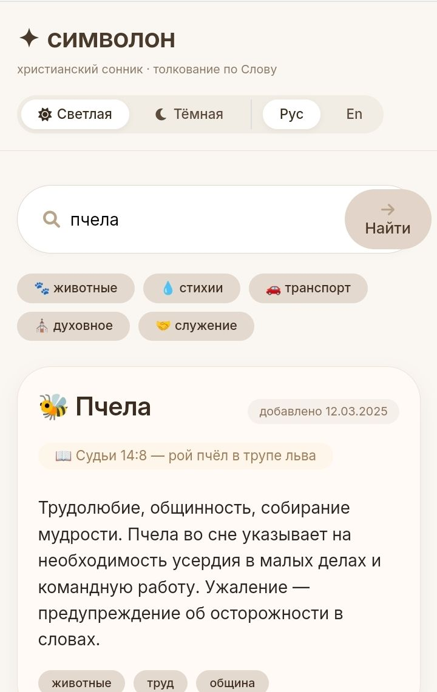
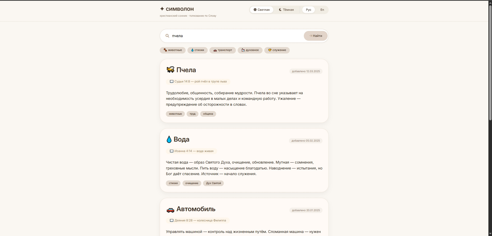

# ✦ udream — сонник по Библии

> Христианский сонник: поиск символов, библейские толкования, адаптивный интерфейс / Christian dream symbols search.

**Коротко:** находите христианские толкования снов. Введите слово — получите описание, библейский стих и теги.

[](https://sunpole.github.io/udream/005/)
[](https://sunpole.github.io/udream/admin7/)
[](https://sunpole.github.io/udream/)
[](LICENSE)

<p>
  <a href="https://sunpole.github.io/udream/005/" target="_blank">
    
  </a>
  <a href="https://sunpole.github.io/udream/admin7/" target="_blank">
    
  </a>
  <a href="https://sunpole.github.io/udream/" target="_blank">
    
  </a>
  <a href="LICENSE" target="_blank">
    
  </a>
</p>****

---

## Зачем это нужно

У нас были две книги на английском с толкованиями символов. Искать в них через Ctrl+F — неудобно (ищет куски слов). Вместо этого я сделал два инструмента:

1. **Просмотр символов** — быстрый поиск по базе, удобный на любом устройстве.
2. **Админка** — для загрузки/редактирования базы, добавления новых символов, экспорта в JSON/CSV.

Никакого сервера, никакой регистрации. Всё работает в браузере, данные остаются у вас.

---

## Эволюция дизайна (живые демо)

Я перебрал четыре варианта интерфейса для просмотра символов. Посмотреть и сравнить можно по ссылкам:

| Версия | Ссылка | Особенности |
|--------|--------|--------------|
| **002** | [посмотреть](https://sunpole.github.io/udream/002/) | Современный, с гамбургер-меню |
| **003** | [посмотреть](https://sunpole.github.io/udream/003/) | Крупный, контрастный, для людей 40+ |
| **004** | [посмотреть](https://sunpole.github.io/udream/004/) | «Стеклянный» стиль, компактные переключатели |
| **005** ⭐ | [посмотреть](https://sunpole.github.io/udream/005/) | **Финальный**: улучшенный контраст, плотные карточки, удобные теги |

**Административная панель** (редактирование базы) доступна в отдельных версиях. Актуальная — [admin7](https://sunpole.github.io/udream/admin7/).

---

## Как это выглядит (финальная версия 005)

| Телефон | Ноутбук |
|---------|---------|
|  |  |

> Скриншоты будут добавлены позже. Пока можно открыть [демо](https://sunpole.github.io/udream/005/) на своём устройстве.

---

## Возможности

**Просмотр символов (версии 002–005):**
- **Поиск с подсказками** — начинаете печатать, появляются варианты
- **Карточка символа** — кратко или подробно, с библейской ссылкой
- **Тёмная / светлая тема** (в плане — реализуется)
- **Теги** — группировка символов
- **Адаптивность** — работает на телефонах и компьютерах

**Админка (admin7):**
- Загрузка и экспорт базы в JSON / CSV
- Добавление, редактирование, удаление символов
- Поиск по названию, описанию и заметкам
- Алфавитный указатель (A–Z и А–Я)
- Фильтрация по источникам книг
- Markdown-заметки с визуальным редактором
- Темная тема
- Автодополнение при поиске

---

## Технологии (без фанатизма)

- HTML / CSS (Flex, Grid, медиазапросы)
- JavaScript (ванильный, без фреймворков)
- SQLite через sql.js — база данных прямо в браузере (в планах)
- GitHub Pages — бесплатный хостинг
- Flatpickr (выбор даты), EasyMDE (Markdown), Marked (парсер)

---

## 📁 Структура репозитория

```
udream/
├── 002/               # первая версия дизайна (гамбургер)
├── 003/               # вторая версия (крупный, контрастный)
├── 004/               # третья версия (стеклянный стиль)
├── 005/               # финальная версия дизайна
├── admin1/ … admin6/  # промежуточные версии админки
├── admin7/            # актуальная версия админки
├── index.html         # корневой редирект (опционально)
├── README.md
├── LICENSE
├── screenshot-mobile.jpg
├── screenshot-desktop.jpg
├── The_Divinity_Code_to_Understanding_Your_Dreams_and_Visions_PDF_Room.pdf
└── Unlocking-Your-Dream-Student-Ma.pdf
```

---

## Как запустить локально

```bash
git clone https://github.com/sunpole/udream.git
cd udream
# для просмотра дизайна:
cd 005
# для админки:
cd admin7
# затем откройте index.html в браузере
```

Или через локальный сервер: `npx serve .`

---

## Лицензия

MIT — делайте что хотите, только упомяните автора.

---
```
## Благодарности

Супруге — за идею и тестирование. @olgamago @olanitsy
Вам — если дочитали до сюда. @SunPole @xcve33
@FamilyOfGod.Minsk
**Живите с миром.**
```
