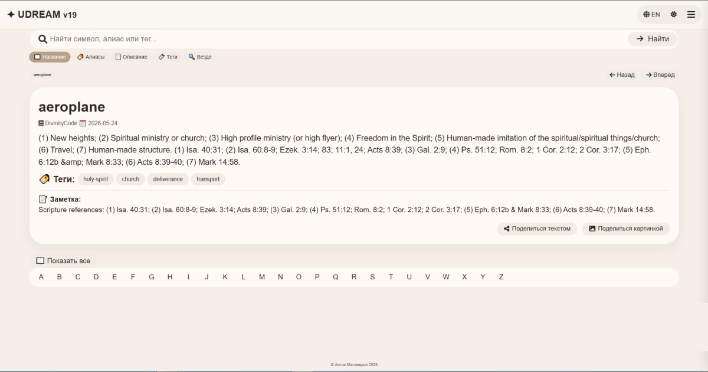

<p align="center">
  
</p>

<h1 align="center">uDream · UDREAM</h1>

<p align="center">
  Христианский справочник символов снов с быстрым поиском, историей и установкой как PWA.
</p>

<p align="center">
  <a href="https://sunpole.github.io/udream/"></a>
  <a href="https://github.com/sunpole/udream/archive/refs/tags/v23.8.0.zip"></a>
  <a href="https://github.com/sunpole/udream/releases/tag/v23.8.0"></a>
  
  
</p>

<p align="center">
  <a href="https://github.com/sunpole/udream/actions/workflows/validate.yml"></a>
  <a href="https://github.com/sunpole/udream/actions/workflows/capture-screenshots.yml"></a>
  <a href="https://t.me/uNewsLog"></a>
  <a href="LICENSE"></a>
</p>



## Быстрый старт

| Действие | Ссылка или способ |
|---|---|
| Открыть приложение | [sunpole.github.io/udream](https://sunpole.github.io/udream/) |
| Установить на телефон | Открыть сайт и нажать баннер установки либо выбрать в меню браузера «Установить приложение» / «Добавить на главный экран» |
| Продолжить разработку | Сначала открыть [WORK_STATUS.md](WORK_STATUS.md), проверить branch/PR/commits и следовать [GitHub-протоколу](docs/AI_GITHUB_WORKFLOW.md) |
| Проверить происхождение баз | [docs/DATA_PROVENANCE.md](docs/DATA_PROVENANCE.md) + `node scripts/validate-data-provenance.mjs` |
| Проверить реестр наборов | [docs/DATASET_REGISTRY.md](docs/DATASET_REGISTRY.md) + `node scripts/validate-dataset-registry.mjs` |
| Открыть аудит качества | [reports/data-quality-audit.md](reports/data-quality-audit.md) |
| Проверить актуальность audit reports | `node scripts/audit-data-quality.mjs --check` |
| Создать реальные screenshot artifacts | Запустить [Capture uDream screenshots](https://github.com/sunpole/udream/actions/workflows/capture-screenshots.yml) либо использовать `tools/screenshots/` локально |
| Скачать стабильный исходный код | [uDream v23.8.0 ZIP](https://github.com/sunpole/udream/archive/refs/tags/v23.8.0.zip) |
| Посмотреть точный релиз | [GitHub Release v23.8.0](https://github.com/sunpole/udream/releases/tag/v23.8.0) |
| Открыть сохранённую версию | [Каталог версий](https://sunpole.github.io/udream/versions/) |
| Следить за обновлениями | [Telegram @uNewsLog](https://t.me/uNewsLog) |

Отдельного APK сейчас нет: uDream устанавливается непосредственно из браузера как PWA. ZIP содержит исходный код точного стабильного релиза и предназначен для разработки, аудита или самостоятельного размещения.

## О проекте

uDream — статическое веб-приложение для поиска и чтения толкований символов из христианской литературы о снах и видениях. Оно заменяет ручной поиск по большим PDF-файлам удобным мобильным интерфейсом.

Проект работает непосредственно в браузере: сервер, регистрация и база данных на стороне сервера не требуются. Текущий интерфейс использует единую версию `UDREAM v23.8.0`. Метка `v19` сохраняется только как историческая интерфейсная итерация в архиве.

Единая миссия, конечный образ продукта и правила сохранения баз и переводов зафиксированы в [видении продукта](docs/PRODUCT_VISION.md).

### Возможности

- релевантный поиск по символам, синонимам, описаниям и тегам с поддержкой Enter и русских алиасов;
- подсказки при вводе и алфавитная навигация;
- карточки символов, перекрёстные ссылки и хлебные крошки;
- история просмотров, светлая и тёмная темы;
- русский и английский интерфейс;
- установка на устройство как PWA;
- автоматическое обновление PWA без зависания на старом кэше;
- каталог сохранённых рабочих версий;
- регрессионные тесты и автоматическая проверка runtime, базы, provenance, dataset registry, data-quality reports, handoff и патчноутов;
- реальные desktop/mobile-скриншоты из точного commit через Playwright Chromium и GitHub Actions artifacts.

## Текущее состояние

| Параметр | Значение |
|---|---|
| Стабильная точка восстановления | `v23.8.0` |
| Текущая версия приложения | `v23.8.0` |
| Документационный/data baseline | `v23.8.10` — D1.3 deterministic data-quality audit |
| Оперативная точка продолжения | [WORK_STATUS.md](WORK_STATUS.md) |
| Активный logical dataset | `ru-current-v1` |
| Активный runtime-файл | `data/divinity_code_ru.json` |
| Количество записей | 4 086 |
| Canonical source dataset | `source-divinity-code-en` |
| Canonical source serialization | `data/bd2.json` |
| Retained compatibility serialization | `data/db.json` |
| Structural audit gate | `PASS` — 0 structural errors |
| Human-review findings | 5 022 instances in 5 aggregated groups; не доказанные ошибки |
| Следующая утверждённая задача | `D1.4` — two-book product architecture |
| Публикация | GitHub Pages из ветки `main` |
| Технологии | HTML, CSS, JavaScript ES Modules, JSON, PWA |

Новый чат, Codex или устройство сначала проверяет реальные GitHub-факты и `WORK_STATUS.md`. Память ИИ, старое сообщение или локальная незапушенная ветка не являются источником истины.

## Реестр данных и переводов

D1.1 доказал, что `data/bd2.json` и `data/db.json` различаются по raw bytes и SHA-256, но содержат одинаковый parsed/canonical JSON из 4 086 записей. Поэтому это две физические сериализации одного logical dataset, а не две базы или два перевода.

D1.2 закрепил стабильные идентификаторы:

```text
source-divinity-code-en
ru-current-v1

source-divinity-code-en-bd2  -> data/bd2.json
source-divinity-code-en-db   -> data/db.json
ru-current-v1-runtime        -> data/divinity_code_ru.json
```

`data/bd2.json` выбран canonical maintained serialization как **project-governance decision**. Это не доказывает, что файл является историческим оригиналом или подтверждённой внешней редакцией. `data/db.json` сохранён как retained equivalent compatibility serialization.

Фактическая миграция не выполнялась:

```text
planned-not-executed
remove_or_rename_approved: false
```

Целевая модель после D1:

- один canonical source dataset;
- один текущий опубликованный русский/localized dataset;
- до двух самостоятельных альтернативных русских переводов, только когда их качество и происхождение можно проверить;
- меньше вариантов, если надёжно существует только один перевод.

DeepSeek API рассматривается только как инструмент создания отдельного candidate dataset. Ключ никогда не встраивается в сайт или PWA; любой результат получает новый dataset ID и проходит автоматическую и человеческую проверку.

## Аудит качества D1.3

D1.3 проверяет зарегистрированные source/current datasets в read-only режиме. Отчёты генерируются детерминированно:

```text
reports/data-quality-audit.json
reports/data-quality-audit.md
```

Подтверждено:

- оба logical datasets содержат 4 086 unique ordered IDs `1–4086`;
- source/current IDs полностью aligned;
- `id`, `symbol`, `description`, `source`, `date_added` имеют 0 различий;
- ожидаемые различия: aliases 4 083, notes 4 086, tags 4 086;
- structural gate прошёл: 0 errors, 0 warnings;
- зарегистрировано 5 022 human-review instances в пяти агрегированных группах.

5 022 — не число доказанных ошибок. Это пересекающиеся кандидаты на проверку: shared aliases, alias-to-primary routing и пустые source notes. Скрипт ничего не исправляет и не меняет файлы данных.

Подробнее: [правила аудита](docs/DATA_QUALITY_AUDIT.md), [читаемый отчёт](reports/data-quality-audit.md), [реестр наборов](docs/DATASET_REGISTRY.md), [происхождение](docs/DATA_PROVENANCE.md) и [переводы](docs/TRANSLATION_WORKFLOW.md).

## Структура репозитория

```text
udream/
├── index.html, script.js        # текущий сайт и оркестрация
├── src/                         # поиск, данные, история, локализация, представление и PWA
├── tests/                       # регрессионные тесты модулей
├── manifest.json, version.json  # PWA metadata и проверка опубликованной версии
├── sw.js                        # offline cache и обновление runtime
├── data/
│   ├── datasets.json            # machine-readable registry, не runtime-база
│   ├── divinity_code_ru.json    # текущий runtime dataset
│   ├── bd2.json                 # canonical source serialization
│   ├── db.json                  # retained equivalent serialization
│   └── report.txt               # исторический отчёт
├── reports/                     # deterministic machine/human audit reports
├── versions/                    # запускаемые контрольные версии
├── news/                        # патчноуты и новые реальные изображения для uNews
├── tools/screenshots/           # изолированные Playwright-сценарии
├── docs/                        # видение, состояние, процессы, provenance, registry и audit
├── scripts/                     # автоматические проверки и read-only audit
├── .github/workflows/           # validation, screenshot artifacts и release automation
├── _archive/                    # исторические версии и исходные материалы
├── WORK_STATUS.md               # текущая задача и GitHub-handoff
├── AGENTS.md                    # обязательные правила разработки
├── CHANGELOG.md                 # история изменений
├── ROADMAP.md                   # завершённое, следующий этап и backlog
└── VERSION.md                   # состояние версий
```

Файлы текущего сайта намеренно находятся в корне: GitHub Pages публикует их напрямую. `data/datasets.json` и `reports/` не загружаются браузером. Исторические эксперименты хранятся отдельно в `_archive/` и не являются рабочим приложением.

## Локальный запуск и проверки

```bash
python3 -m http.server 8019
```

После этого откройте `http://localhost:8019/`. Запуск через `file://` не считается корректной проверкой: браузеры ограничивают `fetch()` и service worker.

```bash
npm test
node scripts/validate-data-provenance.mjs
node scripts/validate-dataset-registry.mjs
node scripts/audit-data-quality.mjs --check
node scripts/validate-project.mjs
```

Локальный Playwright capture:

```bash
cd tools/screenshots
npm ci
npx playwright install --with-deps chromium
npm run capture
```

## Новости и патчноуты

Каждое заметное изменение сопровождается файлом в `news/`. Система [uNews](https://github.com/sunpole/uNews) проверяет новые патчноуты из публичной ветки `main` и через GitHub Actions публикует их в Telegram-канале [@uNewsLog](https://t.me/uNewsLog).

Для новых патчноутов требуется новый реальный PNG/JPEG в том же Pull Request и метаданные источника, цели, commit и UTC-времени захвата. Старую картинку использовать повторно нельзя. Правила описаны в [docs/NEWS_PUBLISHING.md](docs/NEWS_PUBLISHING.md) и [docs/SCREENSHOT_AUTOMATION.md](docs/SCREENSHOT_AUTOMATION.md).

Секреты Telegram и ключи переводческих API в этом репозитории не хранятся.

## Авторство, лицензия и исходные книги

© 2026 Антон Магомедов. Программная оболочка, поисковая логика, структура интерфейса и оригинальная документация uDream распространяются по лицензии [MIT](LICENSE).

Тексты книг, выдержки, словарные толкования, иллюстрации и PDF-файлы третьих лиц **не становятся MIT-контентом** и не объявляются собственностью автора приложения. Права на них сохраняются за соответствующими авторами и правообладателями. Репозиторий не является официальным изданием исходных книг.

Владелец проекта сообщает, что сохранённые PDF были получены из открытых источников, где они предлагались для открытого распространения. Конкретные адреса источников и формулировки разрешений ещё предстоит сохранить в репозитории как подтверждение происхождения; до этого проект не приписывает этим материалам неизвестную свободную лицензию.

Подробнее: [права на код и материалы](docs/CONTENT_AND_RIGHTS.md) и [уведомления о сторонних материалах](THIRD_PARTY_NOTICES.md).

## Документация

- [Текущая задача и точка продолжения](WORK_STATUS.md)
- [Единая работа ИИ, GitHub, чатов и устройств](docs/AI_GITHUB_WORKFLOW.md)
- [Видение и конечная цель продукта](docs/PRODUCT_VISION.md)
- [Проверенное происхождение данных](docs/DATA_PROVENANCE.md)
- [Реестр наборов и migration policy](docs/DATASET_REGISTRY.md)
- [Аудит качества данных](docs/DATA_QUALITY_AUDIT.md)
- [Читаемый audit report](reports/data-quality-audit.md)
- [Переводы и AI-assisted workflow](docs/TRANSLATION_WORKFLOW.md)
- [Реальные скриншоты и Playwright-автоматизация](docs/SCREENSHOT_AUTOMATION.md)
- [Текущее состояние](docs/PROJECT_STATE.md)
- [Архитектура](docs/ARCHITECTURE.md)
- [Формат и сохранение вариантов базы](docs/DATABASE_FORMAT.md)
- [Карта файлов](docs/FILE_MAP.md)
- [Завершённый план модульного перехода](docs/MODULARIZATION_PLAN.md)
- [Публикация новостей](docs/NEWS_PUBLISHING.md)
- [Права на код и материалы](docs/CONTENT_AND_RIGHTS.md)
- [Релизы и восстановление](docs/RELEASE_AND_ROLLBACK.md)
- [Исторический контекст](docs/HISTORICAL_CONTEXT.md)
- [План развития](ROADMAP.md)
- [История изменений](CHANGELOG.md)

Вклад в проект принимается по правилам [CONTRIBUTING.md](CONTRIBUTING.md).
