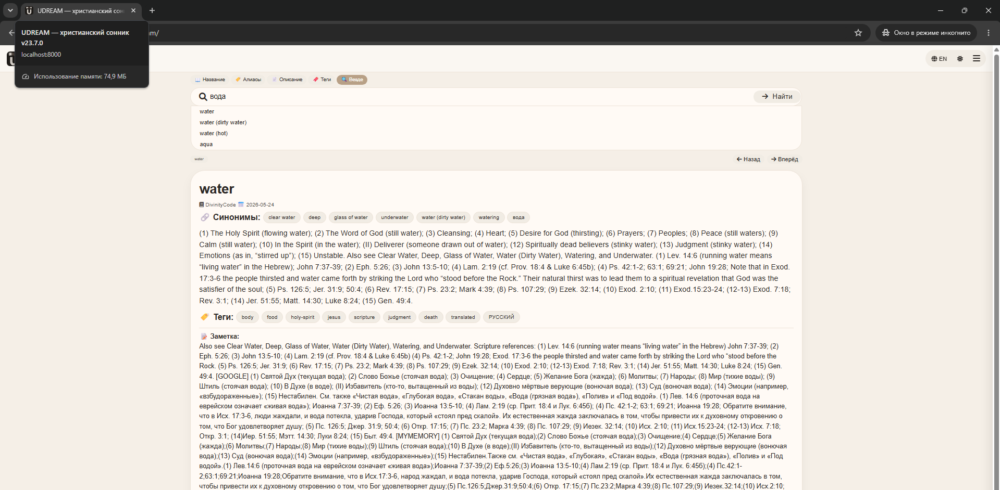

# uDream 23.7.0: поиск стал точнее и удобнее

uDream переходит с исторической интерфейсной метки v19 на единую актуальную версию v23.7.0.

- Enter, Return и мобильная кнопка поиска теперь запускают запрос без обязательного нажатия стрелки.
- Результаты ранжируются по близости к запросу, а не только по порядку записей в базе.
- При запросе `water` точная карточка Water располагается раньше Aqua и более дальних совпадений.
- Русский алиас `вода` открывает основную карточку Water.
- Короткие ссылочные карточки вроде Aqua больше не перекрывают основную карточку символа.
- Нажатие русского алиаса внутри карточки больше не вызывает сообщение «Символ не найден».
- Фильтры «Название», «Алиасы», «Описание», «Теги» и «Везде» ищут только в заявленных областях.
- Режим «Везде» выбран по умолчанию.
- Панель фильтров перенесена над строкой поиска и не прыгает при открытии подсказок.
- Версия v23.7.0 отображается во вкладке, шапке, меню, подвале и PWA.
- Добавлены проверки ранжирования, алиасов, фильтров, Enter и единства версии.
- Все 41 автоматический тест проходят.
- Активная база из 4 086 записей не изменялась.

## Проверка русского алиаса

Короткий текст для Telegram:

Релиз uDream 23.7.0 обновляет поиск и объединяет нумерацию проекта. Water теперь стоит первым при точном запросе, русский алиас «вода» открывает основную карточку Water, Enter запускает поиск, фильтры работают раздельно, а их панель больше не прыгает. Изменения подтверждены 41 тестом и настоящими скриншотами новой версии.
